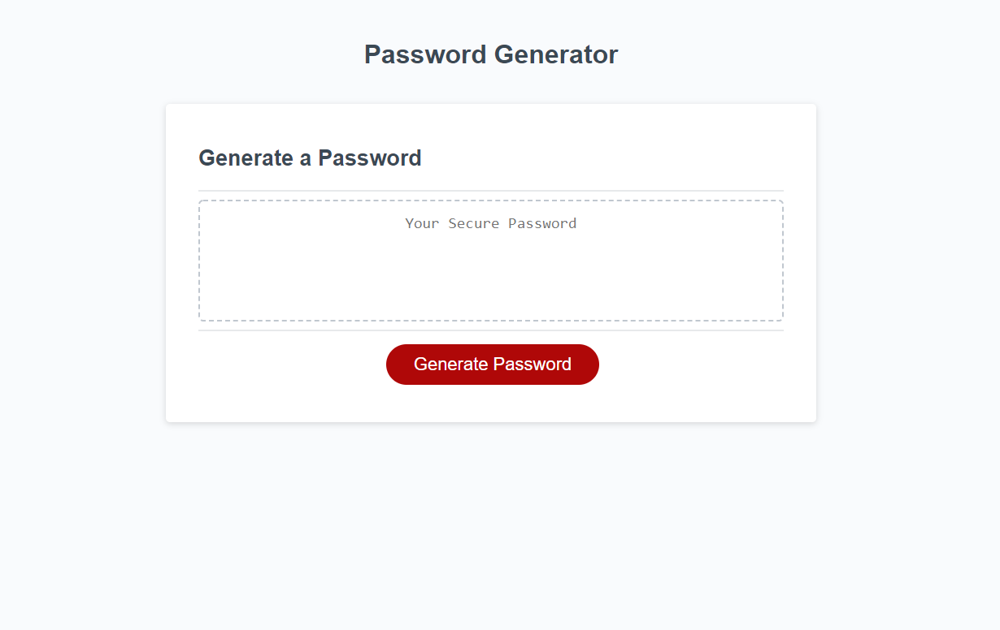

# secure-password-generator
Generates a unique password based on user selected requirements

## deployed website
http://stephenstuder.com/secure-password-generator/

## screenshot

## how it works
The logic is all performed in javascript, the validation uses regex expressions to verify password meets user requirements. 

## future improvements
I could make it all work on the page and through through alerts, i could add a button that allows the user to copy to clipboard, i could add more styling. 